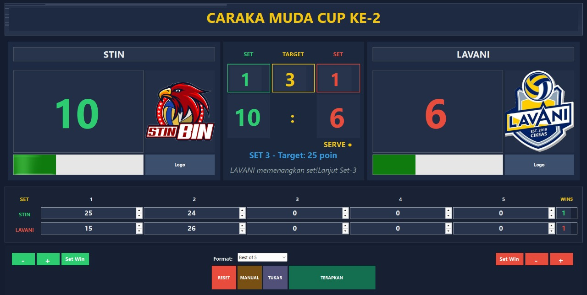

# Volleyball Scoreboard

A simple scoreboard application for volleyball matches.  
Built with C# and .NET, this app allows you to manage scores, team names, and logos in real-time.  

## Features
- Set tournament and team names
- Add team logos
- Increase / decrease team scores
- Reset match easily
- Clean and simple UI for live use

## Appearance

## How to Use
1. Download the latest release from [Releases](../../releases).
2. Run the `VolleyballScoreboard.exe` file.
3. Input team names, logos, and update scores during the match.

## License
This project is licensed under the MIT License – see the [LICENSE](LICENSE) file for details.
